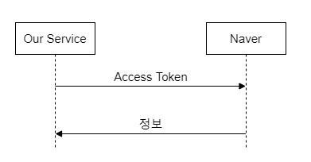
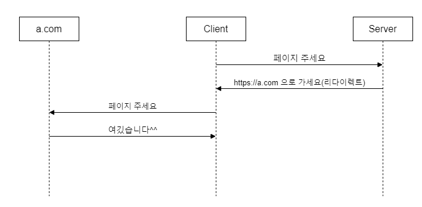

# Oauth 2.0
OAuth는 쉽게 말해서 다른 서비스의 회원 정보를 안전하게 사용하기 위한 방법이라고 생각하면 된다.
여기에서 안전하게의 주체는, 회원 정보를 가지고 있는 주체, 우리의 고객이다.
즉, 우리의 고객이 안전하게 다른 서비스의 정보를 우리 서비스에 건네주기 위한 방법이다.

## Oauth2.0 요약
1. 서비스를 등록하는 과정 
   2. 네이버에 자사 서비스 등록하기 
   3. 이 과정에서 redirect_uri 등을 합의하기
2. 토큰을 받기 위한 과정 
   3. 사용자를 네이버 로그인 페이지로 이동시키기 
   4. 네이버가 사용자를 우리 서비스로 리다이렉트 시키기
3. 토큰을 이용해 정보를 요청하는 과정

## Access Token
* 임의의 문자열 값
* 해당 토큰을 Resource Provider(naver, google, kakao 등)에게 전달함에 따라
해당 고객의 정보들을 받아 올 수 있다.
* Resource provider에게 access Token을 발급 받아서 요청을 위해 발송을 해야 하는데,
이를 위해서는 해당 

## Redirect
* 리다이렉트를 통해 고객은 로그인 페이지를 통해 로그인하고 구현한 클라이언트 페이지로 리다이렉트한다.

