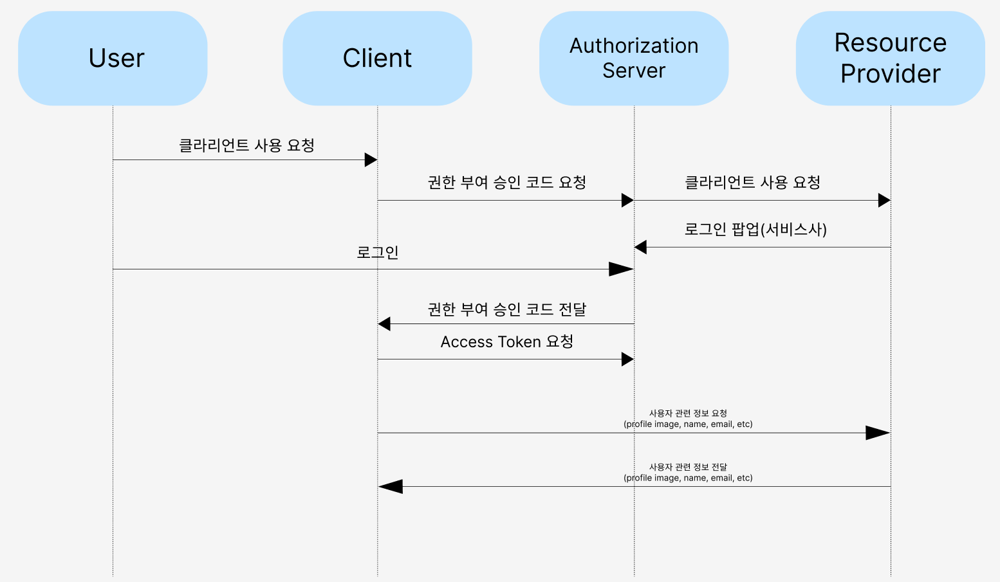
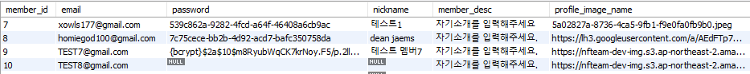
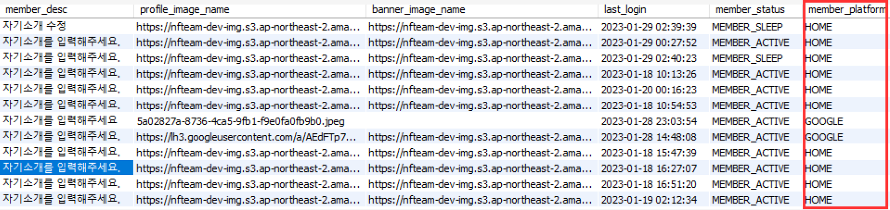
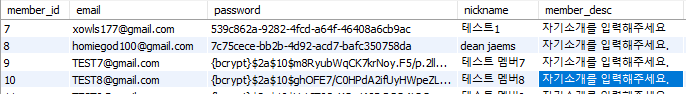

# Oauth 2.0
OAuth는 쉽게 말해서 다른 서비스의 회원 정보를 안전하게 사용하기 위한 방법
여기에서 안전하게의 주체는, 회원 정보를 가지고 있는 주체, 우리의 고객이다.
즉, 우리의 고객이 안전하게 다른 서비스의 정보를 우리 서비스에 건네주기 위한 방법.

## Oauth2.0 요약
1. 서비스를 등록하는 과정 
   2. 네이버에 자사 서비스 등록하기 
   3. 이 과정에서 redirect_uri 등을 합의하기
2. 토큰을 받기 위한 과정 
   3. 사용자를 네이버 로그인 페이지로 이동시키기 
   4. 네이버가 사용자를 우리 서비스로 리다이렉트 시키기
3. 토큰을 이용해 정보를 요청하는 과정

## Access Token
* 임의의 문자열 값
* 해당 토큰을 Resource Provider(naver, google, kakao 등)에게 전달함에 따라
해당 고객의 정보들을 받아 올 수 있다.
* Resource provider에게 access Token을 발급 받아서 요청을 위해 발송을 해야 하는데,
이를 위해서는 해당 

## Oauth2.0 서비스 로직

## Oauth 회원 분리
기존에 다른 팀원 분께서 만들어 놓은 회원가입 로직에 의하면 
비밀번호, 회원 프로필 사진, 아이디 등등 PK(필수로 기입되어야 하는 정보) 등이 많았습니다.
하지만 추후 다른 리소스 서비스들의 Oauth 2.0 구현이 필요한 서비스이기에 기존 회원 테이블에셔
필수로 가져야 하는 정보들을 가져오지 못하는 경우가 생겼습니다. 

> 다음과 같이 10번째 등록된 회원은 password와 nickname이 불러오지 않는 경우가 생긴다.

이를 위해서 다음과 같이 두 가지 방법을 통해서 해결했습니다.
* member_platform column 추가: resource provider들을 제공하는 회사 이름 값을 가지고 해당 column을 회원가입을 어떤 방식으로
하는지 구분 할 수 있게 함.
* default value: 이전의 meber_platform column에 값이 채워지는 회원가입일 경우 필수 값들의 경우 default 값으로 채워지게 서비스 로직 작성

> 다음과 같이 member_platform을 통해서 클라이언틀를 통해 회원 가입했을 경우 'HOME', 서비스를 통해서 회원 가입 했을 경우 access token을 받을 때
> 받은 service 사들의 이름을 받아 등록되게끔 구현했습니다.

>비밀번호는 기존에 있던 PasswordEncoder를 통해서 디폴트 값을 암호화 시켰습니다. 또한, Nickname 같은 경우 이메일에서 받아오지 못할 시 '@' 앞의 문장려을 니네임으로 하게끔 설정했습니다. 
