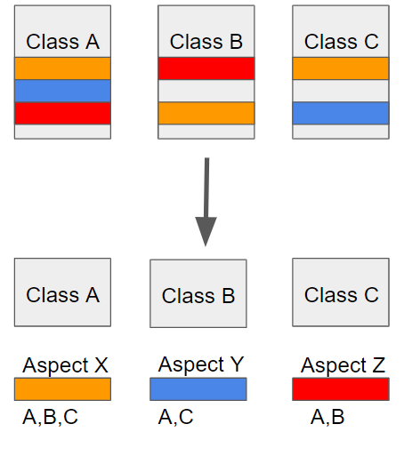

# AOP(Aspect Oriented Programming)

>AOP를 알기 위해서는 일단 다음과 같은 개념을 알아야 한다.

* Aspect: 흩어진 클래스, 인터페이스, 스크립트, 파일 등 흩어진 관심사를 모듈화 한 것을 말한다.
* Target: Aspect를 적용할 위치
* Advice: 실질적으로 어떤 일을 해야할 지에 대한 것, 실질적인 부가기능을 담은 구현체
* JointPoint: Advice가 적용될 위치, 끼어들 수 있는 지점, 메서드 진입 지점, 생성자 호출 시점,
    필드에서 값을 꺼내올 때 등 다양한 시점에 적용 가능
* PointCut: JointPoint의 상세한 스펙을 정의한 것, A란 메서드의 진입 시점에 호출할 것과
같이 더욱 구체적으로 Advice가 실행될 지점을 정의할 수 있음

## 중요: 스프링 AOP는 프록시 개체를 사용한다. 접근 제어 및 부가 기능을 추가하기 위해서다.

## Aspect 실행 지점을 지정할 수 있는 annotation 정리

* @Before: 어드바이스 타겟 메소드가 호출 되기 전에 어드바이스 기능을 수행
* @After: 타겟 메소드의 결과(성공, fail과 상관없이) 타겟 메소드가 완료 되면 어드바이스 기능을 수행
* @AfterRunning: 타겟 메소드가 성공적으로 결과값을 반환 후에 어드바이스 기능을 수행
* @AfterThrowing: 타겟 메소드가 수행 중 예외를 던지게 되면 어드바이스 기능을 수행
* @Aroung: 어드바이스가 타겟 메소드를 감싸서 타겟 메소드 호출전과 후에 어드바이스 기능을 수행