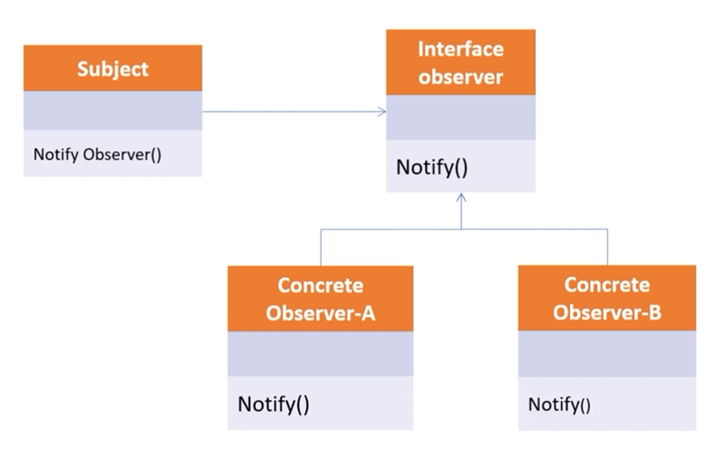

# Observer Pattern

변화가 일어났을 때, 미리 등록된 다른 클래스에 통보해주는 패턴을 구현한 것.
많이 보이는 곳은 event listener에서 해당 패턴을 사용하고 있다.

* 대표적인 예> GUI. jwt, swing, android

1. 이벤트를 전달
2. 그 이벤트에 해당하는 리스너를 등록
3. 리스너와 이벤트를 동시에 등록하는 형태