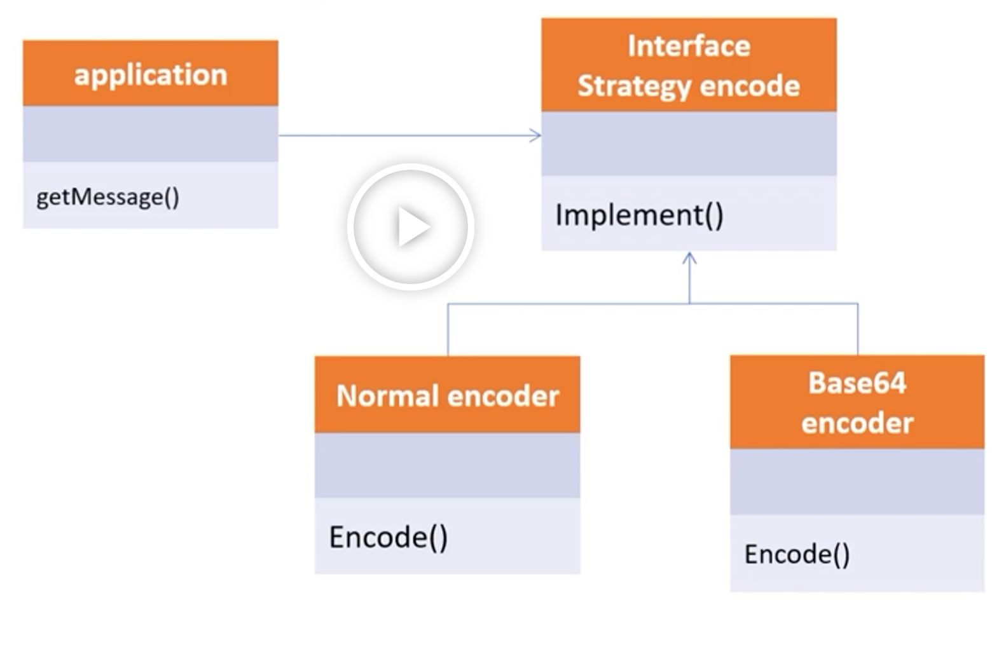

# Strategy Pattern

* 객체지향의 꽃이라고 불린다. 
* 유사한 행위들을 캡슐화하여, 객체의 행위를 바꾸고 싶은 경우 직접 변경하는 것이 아닌 전략만 변경 하여
유연하게 하는 패턴이다.
* SOLID 원칙 중 개방폐쇄 원칙과 의존역전원칙을 따른다.

---
### 실습 예제

* 전략 메서드를 가진 전략 객체
* 전략 객체를 사용하는 컨텍스트
* 전략 객체를 생성해 컨텍스트에 주입하는 클라이언트

