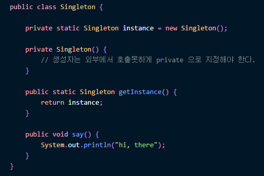

# Singleton Pattern(싱글톤 패턴)

* 객체의 인스턴스가 오직 1개만 생성되는 패턴을 의미
* 싱글톤 예제

    
* 싱글톤의 장점
  * 메모리의 장점을 가져갈 수 있다.
    * new 연산자를 통해서 고정된 메모리 영역을 사용
    ->추후 해당 객체에 접근할 때 메모리 낭비를 방지 가능
    * 다른 클래스 간 데이터 공유가 용이하다.
  * 도메인에 관점에서 1개의 인스턴스만 존재한다고 강조할 때 사용한다.
* 싱글톤의 단점
  * 여러 클래스에에서 싱글톤 인스턴스에 접근하면 동시성 문제가 발생할 수 있다.
  * 구현 방법 외에도 정적 팩토리 메서드에서 객체 생성을 확인하고
  생성자를 호출하는 경우에 멀티스레딩 환경에서 발생할 수 있는 동시성 문제 해결을 활용하기 위해
  synchrozined 어노테이션을 사용해야 하낟.
  * 테스트가 어렵다. 테스트를 진행할 때 동시성 문제 때문에 해당 인스턴스만 격리된 상태에서 테스트틀 진행해야 한다.
  * 의존 관계상 클라이언트가구체 클래스에 의존하게 된다. 이는 SOLIDD 원칙 중
  DIP(의존성 역전) 관계를 위반하므로 좋지 않는 코드가 된다.
  * 내부 클래스 보완 수정이 어렵고, 자식 클래스 생성 불가라는 단덤이 있다